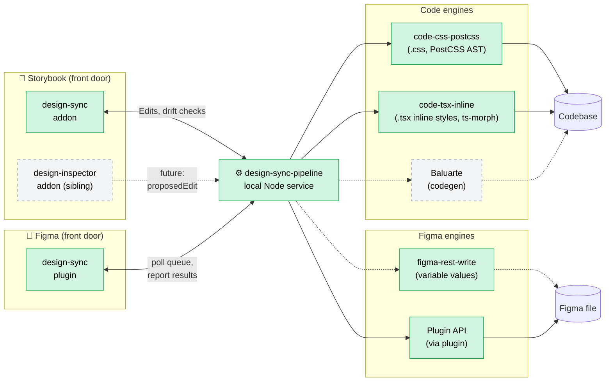

# Architecture

The design-sync system is **three sibling repos** plus the consuming
codebases (e.g. Downmark) and the Figma file. Each repo does one thing.
This file is the central index — start here.

## The three layers



**Solid green = built.** Dashed grey = the seam exists, the implementation is
deferred.

> 📐 **Editable version**: [`docs/architecture.excalidraw`](./docs/architecture.excalidraw) —
> drag onto [excalidraw.com](https://excalidraw.com) or open in the
> VS Code Excalidraw extension. Regenerate after layout changes via
> `node scripts/generate-excalidraw.mjs`.

## Layer 1 — Front doors

Where humans see and trigger things.

| Repo | Surface | What it does |
|------|---------|--------------|
| [`storybook-design-sync`](https://github.com/mylesmetalab/storybook-design-sync) | Storybook addon | Detects drift between a story and its Figma counterpart. Renders a per-row diff. Apply buttons in either direction. |
| [`design-sync-figma-plugin`](https://github.com/mylesmetalab/design-sync-figma-plugin) | Figma plugin | Connects to the pipeline, picks up Figma-scope Edits from its queue, applies them via Plugin API. Also acts as the engine for Figma binding writes. |

A second Storybook addon — `storybook-design-inspector` — emits
`design-sync:proposedEdit` events when users edit tokens live. The pipeline
will consume those once routing is wired up. Listed as future-built above.

## Layer 2 — Pipeline

This repo. **Replaces Syncything.**

- Defines the `Edit` and `EditResult` contract
- Receives Edits via `POST /edits`
- Routes code-scope Edits synchronously through engines
- Routes figma-scope Edits via a queue (the plugin polls it)
- Gates writes (read-only by default; `writeEnabled: true` to enable)
- Localhost-only HTTP, no auth

The pipeline doesn't care what produced the Edit or what consumes it. Front
doors and engines plug in around it.

## Layer 3 — Engines

Engines do the actual writes. Each engine declares which `(kind, scope)`
combinations it handles; the router picks the first match.

| Engine | Built? | Scope × Kind | Notes |
|--------|--------|--------------|-------|
| `code-css-postcss` | ✅ | `code × token-binding`, `code × token-value` | PostCSS-AST rewrite of `var(--old)` → `var(--new)` (binding) or literal → `var(--token)` (value) in configured `.css` files. Replaces the regex `code-css-token-swap` engine that shipped in v0.0.1; PostCSS engine is v0.0.8+. Deterministic, idempotent, stale-checked. |
| `code-tsx-inline` | ✅ | `code × token-binding`, `code × token-value` | ts-morph AST rewrite of `var(--old)` → `var(--new)` (binding) or literal → `var(--token)` (value) inside JSX `style={{ … }}` object expressions in `.tsx`/`.ts`/`.jsx`/`.js` files. Mirrors the CSS engine for codebases that style inline rather than via `.css` files. Same idempotency + stale-check semantics. Follows identifier references to local const declarations (handles `style={stylesConst}` patterns). |
| Plugin API (via plugin) | ✅ | `figma × token-binding` | The Figma plugin acts as both a front door and an engine. Re-binds variants' `boundVariables` for padding, border-radius, gap, border-width, fill/stroke color, box-shadow, and TEXT-descendant typography. |
| `figma-rest-write` | ✅ | `figma × token-value` | Writes variable *values* (e.g. change `radius/lg` from 6 → 8) via Figma's REST Variables API. Doesn't touch bindings. Defaults to dry-run; real writes require `edit.confirm: true`. |
| Baluarte | future | `code × *` | AST-aware code edits. Sits next to the CSS engine, picks up edits the PostCSS engine can't handle (CSS-in-JS, Tailwind, inline React styles). |

## How Baluarte fits

[Baluarte](https://github.com/romedinaML/baluarte) is the **codegen pipeline** —
its job is making components from designs (or templates).

This repo is the **sync pipeline** — its job is keeping existing components
and designs in sync after the fact.

They're complementary. Both can run in the same project. Eventually the sync
pipeline will be able to call into Baluarte as a code-side engine for any
edit that needs more than a regex replace. Until then, they coexist as
parallel tools that each own their layer.

## How a drift fix flows

```
1. User clicks "Check drift" in Storybook
   → addon → fetches story DOM + Figma node, computes diff
   → renders table

2. User clicks "Update Figma" on a drift row
   → addon constructs Edit { scope: "figma", oldValue: figma, newValue: code, target.nodeId }
   → POST /edits to pipeline (long-poll, 30s)
   → pipeline enqueues; code-side caller waits

3. Figma plugin polls /edits/pending every 1.5s
   → drains queue, sees the Edit
   → resolves the variable by name, finds the node, calls setBoundVariable
   → POST /edits/:id/result with the EditResult

4. Pipeline matches result to the long-polled request
   → returns to addon

5. Addon's row turns green ✓
```

The reverse direction (`Update code`) skips the queue entirely — it's
synchronous: pipeline → CSS engine → file write → result back.

## Out of scope

- Figma webhooks / push notifications (today: pull on click)
- Auth, multi-user, network exposure
- Multi-edit transactions
- Persistence / audit log
- Hooking into Syncything (intentionally independent)

## Roadmap

See [`storybook-design-sync/docs/roadmap.md`](https://github.com/mylesmetalab/storybook-design-sync/blob/main/docs/roadmap.md)
for the prioritized list of post-PoC work, including:

- Apply for dual-mode rows where the modes agree (shipped in addon v0.0.20)
- Hash-based skip path for unchanged checks (the addon's persistent cache covers this)
- CI runner that fails PRs on drift (CLI `design-sync audit` shipped in addon v0.0.23)
- Baluarte engine for AST-aware code edits (still future)
